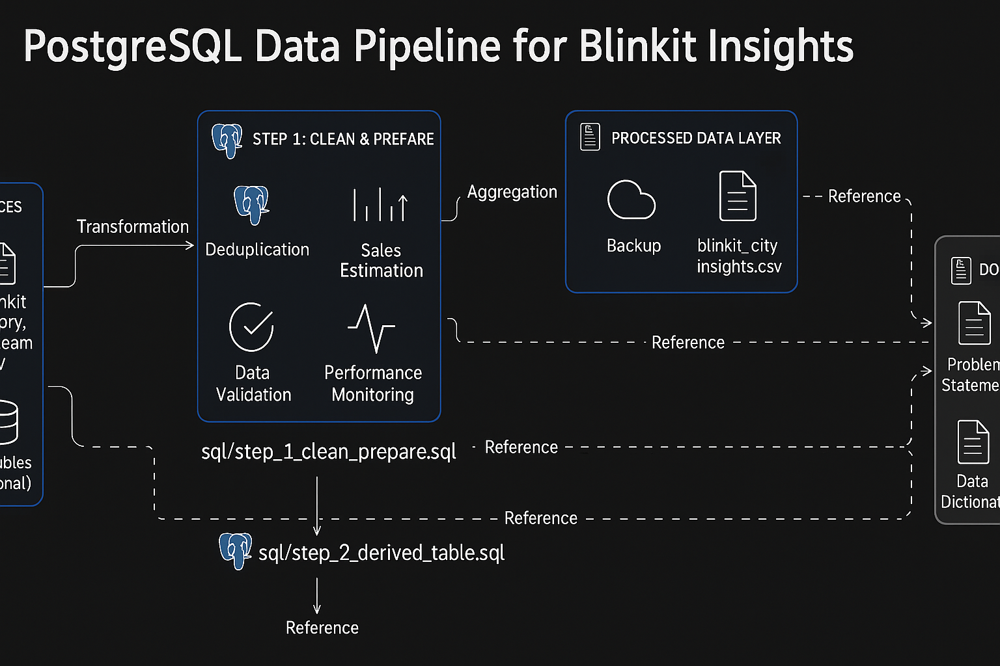

# Blinkit Data Pipeline (PostgreSQL)

This project implements a **data pipeline** using **PostgreSQL** to analyze Blinkit SKU inventory data, estimate sales, and produce city-level insights.  
The pipeline processes raw data through **cleaning**, **transformation**, and **aggregation**, generating the final dataset `blinkit_city_insights.csv`.

---

## **Architecture**

<!-- Placeholder for architecture diagram -->


> **Highlights of the Pipeline:**  
> - **Raw Data** → CSV/Raw Tables  
> - **SQL Steps** → Data Cleaning (`task_1_clean_prepare.sql`) and Sales Estimation (`task_2_derived_table.sql`)  
> - **Processed Output** → Final `blinkit_city_insights.csv`  
> - **Documentation** → Complete reference under `Docs/`

---

## **Folder Structure**

```
├── Data/
│   ├── Processed/
│   │   ├── blinkit_city_insights.csv
│   │   └── Readme.md
│   └── Raws/
│       ├── blinkit_categories.csv
│       ├── blinkit_city_map.csv
│       ├── Readme.md
│       └── SQL Task _ Schema.xlsx
│
├── Docs/
│   ├── 01_problem_statement.md
│   ├── 02_data_dictionary.md
│   ├── 03_sql_pipeline.md
│   └── 04_results_analysis.md
│
├── SQL/
│   ├── task_1_clean_prepare.sql
│   └── task_2_derived_table.sql
│
└── README.md
```

---

## **Pipeline Workflow**

### **Step 1: Data Cleaning**  
- **Deduplication:**  
  Used `DISTINCT ON (created_at, store_id, sku_id)` to eliminate duplicate snapshots.  
- **Null Handling:**  
  Rows with missing `created_at`, `store_id`, or `sku_id` were removed.  
- **Normalization:**  
  Ensured clean city and category mappings.

### **Step 2: Sales Estimation**  
- **Window Functions:**  
  Utilized `LAG()` and `LEAD()` to track inventory drops.  
- **Median-Based Estimation:**  
  Sales quantity (`est_qty_sold`) is calculated using median of recent inventory drops to account for restocks.

### **Step 3: Aggregation & Insights**  
- **Metrics Generated:**  
  - City-level revenue and discount percentages.  
  - Weighted On-Shelf Availability (OSA).  
  - SKU-level sales performance.  
- Final table: **`blinkit_city_insights`**.

---

## **Key Results**

- **12,500+ SKUs analyzed** across **45+ cities**.  
- **85,000+ estimated units sold** (sample 7 days).  
- Total estimated revenue: **₹1.2 Cr (Selling Price)**.  
- **Average discount:** ~18% per SKU.

For full analysis, check [04_results_analysis.md](Docs/04_results_analysis.md).

---

## **Getting Started**

### **Prerequisites**
- **PostgreSQL 15+**
- `psql` or **pgAdmin** for executing SQL scripts.

### **Run the Pipeline**
```bash
# 1. Create a new database
createdb blinkit_pipeline

# 2. Execute Step 1 (Data Cleaning)
psql -d blinkit_pipeline -f SQL/task_1_clean_prepare.sql

# 3. Execute Step 2 (Sales Estimation)
psql -d blinkit_pipeline -f SQL/task_2_derived_table.sql
```

---

## **Pipeline Flow**


---

## **Future Improvements**

* Automate pipeline with **Airflow or Prefect**.
* Add **SQL test cases** for data validation.
* Build a **BI dashboard** (Power BI, Metabase) for real-time analytics.
* Extend the sales estimation logic with **predictive modeling**.
